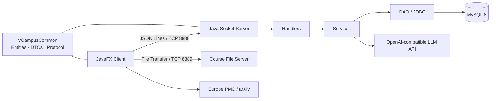

# VCampus 虚拟校园系统

VCampus 是一个面向高校场景的 Java 桌面应用，采用 JavaFX 客户端、原生 Socket 服务端与 MySQL 数据库组成。系统按管理员、教师、学生三类角色提供统一入口，覆盖用户与学籍、课程、图书馆、校园商店、校园卡、聊天、论文检索和 AI 助手等校园业务。

> 当前项目使用 JDK 25 / JavaFX 25，依赖以 JAR 形式随仓库维护，不使用 Maven 或 Gradle。

## 功能概览

| 模块 | 主要能力 |
| --- | --- |
| 账号与权限 | 注册、登录、找回密码、角色路由、管理员权限控制、在线会话 |
| 学生与教师信息 | 档案查看与修改申请、审核、批量处理、PDF/Excel 导出、家庭与经历信息 |
| 课程与教务 | 课程目录、选课与退课、候补队列、培养方案、课表、成绩查询、实时事件推送 |
| 教师工作台 | 教学班与花名册、调课申请、成绩册编辑、Excel 文件传输与成绩提交 |
| 教务管理 | 课程和教学班维护、排课与冲突检查、选课名单管理、调课和成绩审批 |
| 图书馆 | 图书检索、借阅、预约、归还、挂失、罚款、书评、在线 PDF 预览与下载 |
| 校园商店 | 商品、购物车、订单、支付、退款、评价、商品图片与缩略图缓存 |
| 校园卡 | 账户、充值、转账、流水、账单与报销业务 |
| 校园聊天 | 好友申请、会话、未读消息、在线推送、头像展示 |
| 论文检索 | Europe PMC 与 arXiv 检索、摘要查看和 PDF 获取，支持独立代理配置 |
| AI 助手 | 对话管理、意图路由、知识库检索、引用记录、Token 计费和离线回退 |

## 系统架构



客户端与服务端共享 `VCampusCommon` 中的实体、DTO、枚举和消息协议。普通业务请求通过一条按行传输 JSON 的长连接完成；课程成绩表等二进制文件使用带临时票据的独立短连接，避免混入业务消息流。

## 技术栈

- Java 25、JavaFX 25、FXML、CSS
- 原生 TCP Socket、Gson JSON 协议
- MySQL 8、JDBC
- LangChain4j 与 OpenAI 兼容接口
- Apache PDFBox
- Hutool、OkHttp、Retrofit
- PowerShell / Batch / Python 构建与数据库脚本

## 项目结构

```text
VCampus/
├─ VCampusClient/              JavaFX 客户端
│  ├─ src/app/                 启动入口
│  ├─ src/controller/          页面控制器
│  ├─ src/model/               客户端视图模型
│  ├─ src/service/             Socket 服务适配与外部检索
│  ├─ src/network/             连接、收包与消息分发
│  ├─ src/resources/           FXML、CSS、图片和 PDF 模板
│  └─ lib/                     JavaFX 与客户端依赖
├─ VCampusServer/              服务端
│  ├─ src/main/                服务端入口
│  ├─ src/network/             Socket、连接池与文件服务
│  ├─ src/handler/             协议请求处理
│  ├─ src/service/             业务服务
│  ├─ src/dao/                 JDBC 数据访问
│  ├─ src/resources/           配置、建库 SQL、迁移与种子数据
│  └─ lib/                     JDBC、AI 与服务端依赖
├─ VCampusCommon/              客户端和服务端共享代码
│  └─ src/                     实体、DTO、枚举、协议与通用规则
├─ scripts/                    数据库初始化脚本
├─ tests/                      跨模块回归检查
├─ docs/                       专题文档、设计与版本说明
├─ library-files/              图书在线预览示例 PDF
├─ setup-database.bat          Windows 一键建库
└─ package.ps1 / package.bat   编译和打包脚本
```

## 快速开始

### 1. 环境要求

- Windows 10/11
- JDK 25（项目当前 IntelliJ 配置为 JDK 25）
- MySQL 8.x
- Python 3
- MySQL 命令行工具 `mysql` 和 `mysqldump` 已加入 `PATH`

可先检查环境：

```powershell
java -version
javac -version
python --version
mysql --version
mysqldump --version
```

### 2. 配置数据库

复制配置模板：

```powershell
Copy-Item VCampusServer/src/resources/db.properties.example `
  VCampusServer/src/resources/db.properties
```

编辑 `VCampusServer/src/resources/db.properties`：

```properties
db.driver=com.mysql.cj.jdbc.Driver
db.url=jdbc:mysql://localhost:3306/virtual_campus?useSSL=false&serverTimezone=UTC&characterEncoding=utf8
db.username=root
db.password=your_password
```

创建基础结构、按顺序执行迁移并导入课程演示数据：

```powershell
./setup-database.bat
```

也可以直接运行 Python 入口：

```powershell
python scripts/setup-database.py --demo
```

不需要课程演示数据时去掉 `--demo`。脚本会在改动已有数据库前将备份写入 `.codex-tmp/database-backups/`，并通过 `_vcampus_sql_history` 防止迁移被重复执行或被静默修改。更完整的规则见 [数据库构建文档](docs/数据库构建.md)。

### 3. 配置可选功能

AI 助手优先读取环境变量；未配置密钥时自动使用离线回答模式：

```powershell
$env:AI_API_KEY = "your_api_key"
# 也支持 $env:DEEPSEEK_API_KEY
```

模型端点和模型名位于 `VCampusServer/src/resources/server.properties`。请勿把真实 API Key 提交到版本库。

论文检索需要代理时，复制并编辑配置：

```powershell
Copy-Item config/paper-network.properties.example config/paper-network.properties
```

代理可设为 `system`、`direct`、`http` 或 `socks`，详细说明见 [论文检索文档](docs/论文检索.md)。

### 4. 编译与打包

从项目根目录运行：

```powershell
./package.bat
```

或指定 JDK：

```powershell
./package.ps1 -JavaHome "C:\Program Files\Java\jdk-25"
```

脚本会依次编译 `VCampusCommon`、`VCampusServer`、`VCampusClient`，复制资源和依赖，并生成：

```text
dist/VCampusServer/VCampusServer.jar
dist/VCampusServer/start_server.bat
dist/VCampusClient/VCampusClient.jar
dist/VCampusClient/start_client.bat
```

`package.ps1` 当前会从 `D:\JavaFX\javafx-sdk-25.0.4\bin` 复制 Windows JavaFX 原生 DLL；若本机 JavaFX 安装在其他位置，请修改脚本中的 `$javafxBin`，或确保运行环境能加载匹配的 JavaFX 25 原生库。

### 5. 启动系统

先启动服务端，再启动客户端：

```powershell
./dist/VCampusServer/start_server.bat
./dist/VCampusClient/start_client.bat
```

默认端口：

| 用途 | 地址/端口 | 说明 |
| --- | --- | --- |
| 业务连接 | `localhost:8888` | 客户端默认连接地址，JSON 长连接 |
| 成绩文件传输 | `8889` | 可用 JVM 参数 `-Dvcampus.courseFilePort=端口` 覆盖 |
| MySQL | `localhost:3306` | 以 `db.properties` 为准 |

当前客户端默认使用本机服务端。如需跨机器运行，需要在启动客户端前调用 `SocketClient.init(host, port)` 或增加相应的外部配置入口，并让服务端监听可访问的网卡地址。

## 演示账号

执行带 `--demo` 的数据库初始化后，可以使用以下账号。演示数据的初始密码均为 `123456`；如果账号原本已存在，脚本不会重置其密码。

| 角色 | 账号 | 适用场景 |
| --- | --- | --- |
| 学生 | `213242789` | 选课、课表、成绩及学生业务 |
| 教师 | `teacher01` | 教师课程、调课与成绩管理 |
| 课程管理员 | `admin3` | 课程目录、排课、选课名单与审批 |
| 系统管理员 | `admin` | 综合管理功能 |

演示账号仅用于本地开发和课程展示，请勿用于生产环境。

## 配置说明

| 文件 | 用途 | 是否应提交真实值 |
| --- | --- | --- |
| `VCampusServer/src/resources/db.properties` | 数据库连接 | 否，已被 `.gitignore` 忽略 |
| `VCampusServer/src/resources/db.properties.example` | 数据库配置模板 | 是 |
| `VCampusServer/src/resources/server.properties` | 服务端与 AI 模型配置 | 不应包含真实密钥 |
| `config/paper-network.properties` | 论文网络代理 | 否，已被 `.gitignore` 忽略 |
| `config/paper-network.properties.example` | 代理配置模板 | 是 |

服务端建立数据库连接后会执行 `SET time_zone = '+00:00'`。课程模块中以 `_utc` 结尾的时间字段应始终按 UTC 写入和比较，展示时再转换为本地时区。

## 测试

仓库中的测试以可独立运行的 Java `main` 测试为主，分布在：

- `VCampusCommon/test/`：协议、DTO JSON 和成绩计算等纯逻辑测试
- `VCampusClient/test/`、`VCampusClient/tests/`：客户端模型、服务、控制器和 FXML 冒烟测试
- `VCampusServer/test/`、`VCampusServer/tests/`：DAO、服务、网络、数据库与 Socket 端到端测试
- `tests/information/`：信息管理模块的跨端回归检查

信息管理回归可直接运行：

```powershell
./tests/information/run.ps1 -JavaFxBin "D:/JavaFX/javafx-sdk-25.0.4/bin"
```

其中部分服务端测试会连接真实 MySQL，运行前请先阅读测试类和数据夹具，确认目标数据库与前置数据。课程测试数据 `seed-course-test.sql` 应使用独立测试库，不要与演示库混用。

## 数据库与种子数据

数据库资源位于 `VCampusServer/src/resources/`：

- `init.sql`：基础表、基础账号及主要业务数据
- `migrations/`：课程、信息、AI、聊天和商店等增量结构
- `seed/seed-course-demo.sql`：课程演示数据
- `seed/seed-product-images.sql`：商品示例图片
- `sample_library_data.sql`：图书馆测试数据
- `sample_chat_data.sql`：聊天申请示例数据
- `seed-course-test.sql`：课程模块测试夹具

不要将所有 SQL 文件一次性混合执行。推荐始终使用 `scripts/setup-database.py`；单独导入某类数据前，请先查看 [数据库构建文档](docs/数据库构建.md) 中的前置条件。

## 相关文档

- [数据库构建](docs/数据库构建.md)
- [信息管理模块](docs/信息管理模块_README.md)
- [校园聊天](docs/校园聊天.md)
- [论文检索](docs/论文检索.md)
- [图书在线预览与下载](docs/图书在线预览与下载.md)
- [图书状态联动](docs/图书状态联动.md)
- [图书副本模型](docs/library-copies.md)
- [商品图片部署](docs/shop-product-images-deployment.md)
- [版本说明](docs/v0.1_Week2_Mon_版本说明.md)

## 开发约定

- 新的跨端数据结构放入 `VCampusCommon`，保证客户端与服务端使用同一协议定义。
- 新的请求先在共享协议中定义，再分别接入客户端 service 与服务端 handler/service/DAO。
- 页面布局使用 FXML，交互放在 controller，通用 UI 能力放在 `util`。
- 数据库结构变更应新增迁移文件，不要修改已经执行过的迁移。
- 密码、API Key、代理认证信息和本机路径不得提交到仓库。
- 保持 UTF-8 编码；数据库使用 `utf8mb4`。

## 说明

本项目目前主要面向课程开发、功能演示和本地部署。仓库尚未配置开源许可证；在添加 LICENSE 前，代码的复制、分发和再授权需获得项目维护者许可。
